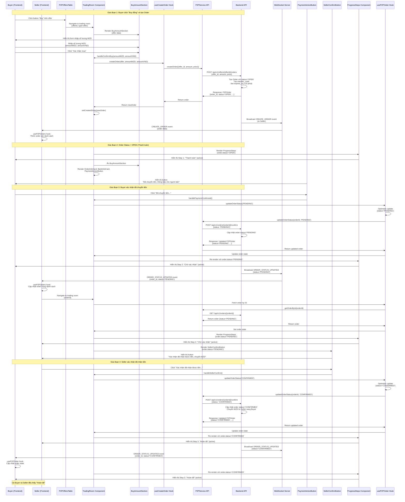

# Sequence Diagram: P2P Trading Flow - Từ "Buy đồng" đến "Hoàn tất"

## Mô tả các giai đoạn:

### Giai đoạn 1: Tạo Order (Status: OPEN)
- Buyer click "Buy" trên bảng offers
- Buyer nhập số lượng MZD muốn mua
- Buyer click "Xác nhận mua"
- Hệ thống tạo Order với status='OPEN'
- Seller nhận thông báo qua WebSocket về order mới

### Giai đoạn 2: Thanh toán (Status: OPEN)
- ProgressSteps hiển thị Step 1: "Thanh toán" (active)
- Buyer thấy thông tin ngân hàng và transfer_code
- Buyer thực hiện chuyển khoản ngoài hệ thống

### Giai đoạn 3: Chờ xác nhận (Status: PENDING)
- Buyer click "Đã chuyển tiền, thông báo cho người bán"
- Order status chuyển sang 'PENDING'
- ProgressSteps hiển thị Step 2: "Chờ xác nhận" (active)
- Seller nhận thông báo và vào trading room

### Giai đoạn 4: Hoàn tất (Status: CONFIRMED)
- Seller click "Xác nhận đã nhận được tiền, chuyển MZD"
- Order status chuyển sang 'CONFIRMED'
- Backend chuyển MZD từ Seller sang Buyer
- ProgressSteps hiển thị Step 3: "Hoàn tất" (active)
- Cả Buyer và Seller đều thấy trạng thái "Hoàn tất"

